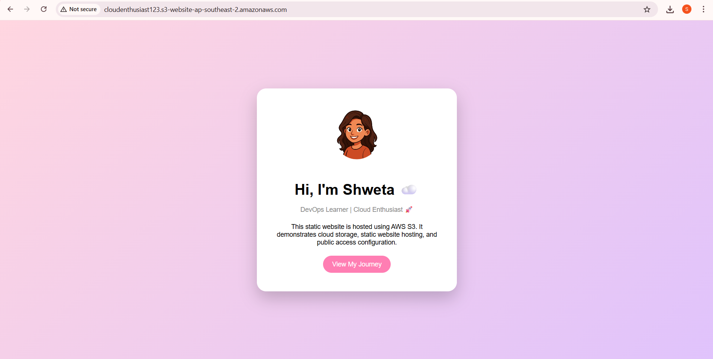

# Static Website Hosting using AWS S3

## 📌 Project Overview

This project demonstrates how to host a static website using Amazon S3.  
The website was developed locally and deployed to AWS S3 using static website hosting feature.

---

## ☁️ AWS Services Used

- Amazon S3 (Object Storage)
- S3 Static Website Hosting
- Bucket Policy for Public Access

---

## 🏗 Architecture

User Browser  
↓  
Amazon S3 Bucket (Static Website)

---

## 🛠 Steps Performed

1. Created an S3 bucket
2. Disabled Block Public Access
3. Uploaded website files (index.html, style.css, profile.jpg)
4. Enable Make public using ACL
5. Enabled Static Website Hosting
6. Configured Bucket Policy to allow public read access
7. Accessed website using S3 endpoint URL

---

## 📦 Storage Class Used

S3 Standard

Reason:
Used for frequently accessed website content with high availability and durability.

---

## 🔄 Versioning Implementation

Versioning was enabled to:

- Maintain multiple versions of same objects
- Protect against accidental deletion
- Rollback to previous version
- Improve data durability

## ⚠️ Issue Faced & Resolved

Issue:
403 Forbidden error occurred while accessing endpoint.

Reason:
- Files were uploaded inside a folder instead of root directory.

Resolution:
- Uploaded files directly to bucket root level.
- Verified bucket policy and public access settings.

---

## ✅ Final Output

The static website is successfully hosted and accessible via S3 endpoint URL.

<h3>✅ Final Website Output</h3>

---

## 🚀 Future Improvements

- Enable Versioning
- Add CloudFront for CDN
- Configure HTTPS
- Attach custom domain using Route 53
