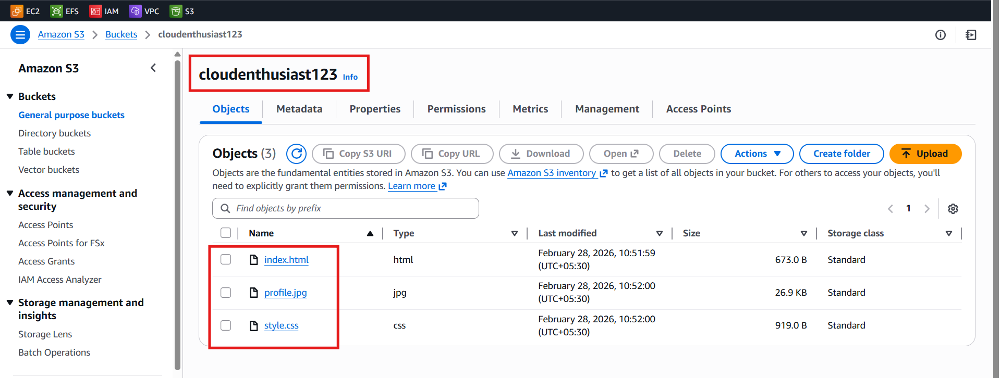
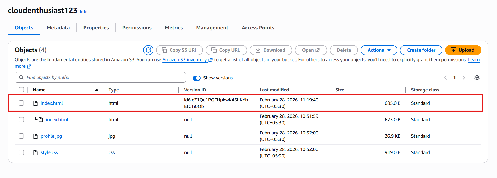
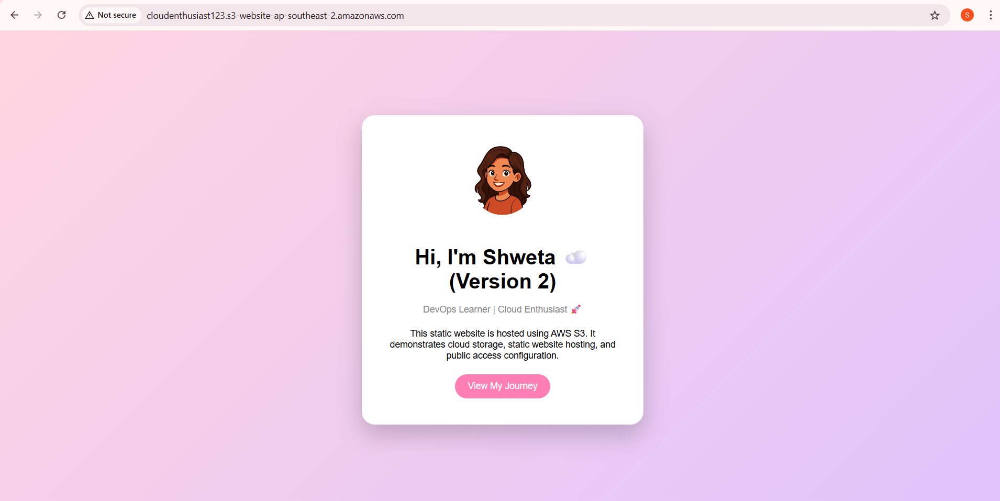

# Static Website Hosting using AWS S3

## 📌 Project Overview

This project demonstrates how to host a static website using Amazon S3.  
The website was developed locally and deployed to AWS S3 using static website hosting feature.

---

## ☁️ AWS Services Used

- Amazon S3 (Object Storage)
- S3 Static Website Hosting
- Bucket Policy for Public Access

---

## 🏗 Architecture

User Browser  
↓  
Amazon S3 Bucket (Static Website)

---

## 🛠 Steps Performed

1. Created an S3 bucket
2. Disabled Block Public Access
3. Uploaded website files (index.html, style.css, profile.jpg)
4. Enable Make public using ACL
5. Enabled Static Website Hosting
6. Configured Bucket Policy to allow public read access
7. Accessed website using S3 endpoint URL
---



---

### Configured Bucket Policy

Added policy to allow public read access:

```json
{
  "Version": "2012-10-17",
  "Statement": [
    {
      "Sid": "PublicReadGetObject",
      "Effect": "Allow",
      "Principal": "*",
      "Action": "s3:GetObject",
      "Resource": "arn:aws:s3:::YOUR-BUCKET-NAME/*"
    }
  ]
}
```

This allowed public users to access website files.

---

## 📦 Storage Class Selection

**S3 Standard** was used because:

- Website content is frequently accessed
- Requires low latency
- Provides high availability (99.99%)
- Offers 99.999999999% durability

S3 Standard is ideal for active production workloads.

---

## ⚠️ Issue Faced & Resolved

Issue:
403 Forbidden error occurred while accessing endpoint.

Reason:
- Files were uploaded inside a folder instead of root directory.

Resolution:
- Uploaded files directly to bucket root level.
- Verified bucket policy and public access settings.

---

## ✅ Final Output

The static website is successfully hosted and accessible via S3 endpoint URL.

<h3>✅ Final Website Output</h3>


---

## 🔄 S3 Versioning Implementation

Versioning was enabled to:

- Maintain multiple versions of objects
- Protect against accidental deletion
- Restore previous versions
- Improve data durability

### Steps Performed:

1. Enabled Versioning in bucket properties.
2. Modified index.html locally.
3. Uploaded updated file (created new version).
4. Verified versions using "Show Versions".
5. Deleted latest version to test rollback.
6. Successfully restored previous version.






